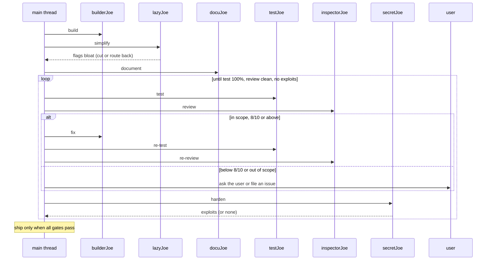

SuperJoe = a crew. Use it as an **iterative loop**, not a one-shot dispatch. The main thread runs the loop; agents do one step each.

## The loop

Run in order. Restart at step 1 whenever a later step fails.

1. **Build** — `builderJoe` produces minimal, working code.
1. **Simplify** — `lazyJoe` flags over-engineering and bloat. Cut it, or route back to `builderJoe`.
1. **Document** — `docuJoe` documents the public surface.
1. **Test** — `testJoe` covers every branch, 100%, no unreachable code.
1. **Review** — `inspectorJoe` lists issues with location, one-line reason, and `confidence: N/10`. Fix the `8/10` and above, then re-run; ask the user before touching anything below.
1. **Harden** — `secretJoe` hunts vulnerabilities with proof and `confidence: N/10`. Route the `8/10` and above to `builderJoe`; ask the user before touching anything below.

## Exit gates

Ship only when ALL pass:

- `inspectorJoe` reports no in-scope issue at `8/10` or above
- `testJoe` reports 100% coverage
- `secretJoe` finds nothing exploitable in scope

Findings below `8/10` never block the gate: the user approves them or they are deferred.

Any gate failing sends the work back to the step that owns it. Keep looping until all three are green.

## Findings

Every agent reports a finding once. Route on the first line that matches:

| Finding                            | Route                                     |
| ---------------------------------- | ----------------------------------------- |
| in scope, `8/10` or above          | fix it, then re-run the step that owns it |
| in scope, below `8/10`             | ask the user first                        |
| out of scope (`defer:`)            | file a GitHub issue, change nothing       |
| vulnerability                      | `secretJoe`; nobody else reports one      |
| bug, performance, naming, coverage | `inspectorJoe`; nobody else reports one   |
| over-engineering, dead code        | `lazyJoe`; nobody else reports one        |

## Out-of-scope findings

A finding outside the work under review is deferred, never fixed:

1. The reviewer emits one `defer: <what>. <why>. [path]` line.
1. The main thread files one `gh issue create` per line, carrying the line verbatim, the repo, and the work reference.
1. No agent addresses it. `builderJoe`, `docuJoe`, and `testJoe` treat deferred findings, and any other out-of-scope code they notice, as untouchable.

Deferral covers feature and PR work. One-shot repo-wide reports (`joe-audit`, `joe-debt`) are exempt: their findings are the deliverable.

## Modes

The crew simplifies at one of three levels. Default: **full**. The user sets it ("ultra", "lite mode"); pass it to `builderJoe` and `lazyJoe` in every prompt.

| Mode  | builderJoe                                                                      | lazyJoe                                                       |
| ----- | ------------------------------------------------------------------------------- | ------------------------------------------------------------- |
| lite  | Builds what's asked; names the lazier alternative in one line.                  | Flags only clear rung violations.                             |
| full  | The ladder enforced: YAGNI -> reuse -> stdlib -> native -> one line -> minimum. | Flags every rung violation.                                   |
| ultra | YAGNI extremist: deletion before addition; challenges the requirement itself.   | Flags speculative anything, including tests beyond one check. |

## One-shot reports

Outside the loop, on request:

- `joe-audit` — whole-repo over-engineering audit, ranked list of what to delete.
- `joe-debt` — harvest `joe:` shortcut comments into a tracked ledger.

## Prompting agents

Prompt = work reference + user story or QED + explicit user instructions for the task. Nothing else. No task lists, no step-by-step, no output contracts.

Include what grounds the agent:

- Minimal file refs: `src/auth.ts`
- Scope: the work reference bounds the review; anything else gets a `defer:` line
- Prior review: `see review on PR #12` or `see <branch> diff: git diff main...branch`
- Goal: one user story sentence, exception message or expected behaviour (bugs only)
- Steps: QED, short, numbered bullets to reproduce the error
- Explicit user instructions for the task, verbatim.

Prompt shape:

```text
Work: <file(s)> or <PR/branch diff reference>
Goal: As a <role>, I want <capability>, so that <benefit>.
User said: <explicit instruction, verbatim>
```

or

```text
Work: <file(s)> or <PR/branch diff reference>
Goal: Should return boolean
Steps: 1. click this 2. click that 3. boom! QED
User said: <explicit instruction, verbatim>
```

## Agents

task -> agent

write minimal surgical code -> `builderJoe`
trim bloat / over-engineering -> `lazyJoe`
concise goal-oriented docs -> `docuJoe`
review minimalism/perf -> `inspectorJoe`
security research -> `secretJoe`
find & evaluate packages -> `researchJoe`
orchestrate the loop -> main thread

Rule: main thread loops; each agent does one step. Spawn `researchJoe` from any step when a dependency or fact needs checking; it never edits.

## Flow


