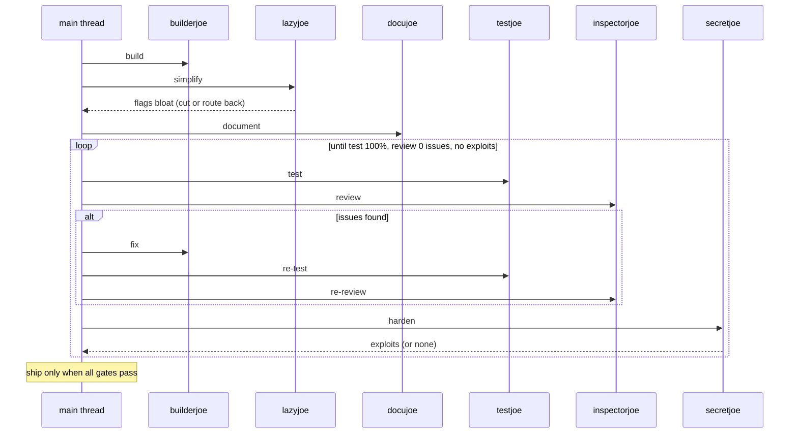

Superjoe = a crew. Use it as an **iterative loop**, not a one-shot dispatch. The main thread runs the loop; agents do one step each.

## The loop

Run in order. Restart at step 1 whenever a later step fails.

1. **Build** — `builderjoe` produces minimal, working code.
1. **Simplify** — `lazyjoe` flags over-engineering and bloat. Cut it, or route back to `builderjoe`.
1. **Document** — `docujoe` documents the public surface.
1. **Test** — `testjoe` covers every branch, 100%, no unreachable code.
1. **Review** — `inspectorjoe` lists issues with location + one-line reason. Fix each, then re-run.
1. **Harden** — `secretjoe` hunts vulnerabilities. Fix or route to `builderjoe`.

## Exit gates

Ship only when ALL pass:

- `inspectorjoe` reports zero issues
- `testjoe` reports 100% coverage
- `secretjoe` finds nothing exploitable

Any gate failing sends the work back to the step that owns it. Keep looping until all three are green.

## Prompting agents

Prompt = work reference + user story + explicit user instructions for the task. Nothing else. No task lists, no step-by-step, no output contracts.

Include what grounds the agent:

- Files: `src/auth.ts`
- Prior review: `see review on PR #12` or `see <branch> diff: git diff main...branch`
- Goal: one user story sentence.
- Explicit user instructions for the task, verbatim.

Prompt shape:

```text
Work: <file(s)> or <PR/branch diff reference>
Goal: As a <role>, I want <capability>, so that <benefit>.
User said: <explicit instruction, verbatim>
```

## Agents

task -> agent

write minimal surgical code -> `builderjoe`
trim bloat / over-engineering -> `lazyjoe`
concise goal-oriented docs -> `docujoe`
review minimalism/perf -> `inspectorjoe`
security research -> `secretjoe`
find & evaluate packages -> `researchjoe`
orchestrate the loop -> main thread

Rule: main thread loops; each agent does one step. Spawn `researchjoe` from any step when a dependency or fact needs checking; it never edits.

## Flow


