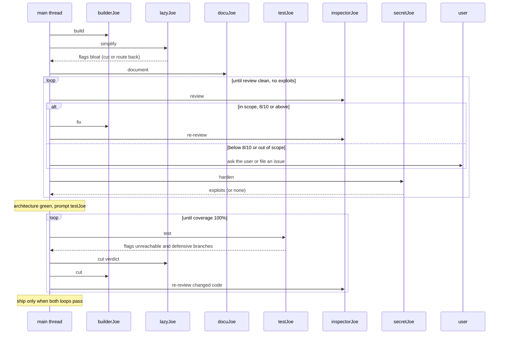

SuperJoe = a crew. Use it as two **iterative loops**, not a one-shot dispatch: architecture first, then testing. The main thread runs the loops; agents do one step each.

## Tests

NEVER run tests, a test runner, or the test suite from the main thread.
NEVER run linters or pre-commit hooks.
Route every test run to `testJoe`.

## The architecture loop

Run in order. Restart at step 1 whenever a later step fails.

1. **Build** — `builderJoe` produces minimal, working code.
1. **Simplify** — `lazyJoe` flags over-engineering and bloat. Cut it, or route back to `builderJoe`.
1. **Document** — `docuJoe` documents the public surface and deletes docstrings nobody asked for.
1. **Review** — `inspectorJoe` lists issues as location, reason, `confidence: N/10`. Fix `8/10` and above, then re-run; ask the user below that.
1. **Harden** — `secretJoe` proves vulnerabilities with `confidence: N/10`. Route `8/10` and above to `builderJoe`; ask the user below that.

## Exit gates

Ship only when both loops pass.

Architecture: no in-scope issue at `8/10` or above, nothing exploitable in scope.

Testing: 100% coverage, every flagged branch cut.

Findings below `8/10` never block the gate: the user approves them or they are deferred. A failing gate sends the work back to its owner.

## The testing loop

Its own loop, prompted once the architecture loop is green, never a step inside it.

1. `testJoe` writes tests, hits 100% coverage, flags unreachable branches and checks the signature already guarantees. It runs the hooks with `prek` and reports every finding back; an autofix still counts as a finding. It edits no production code.
1. `lazyJoe` tags each flag `delete:`.
1. `builderJoe` cuts it.

`testJoe` re-runs coverage after every cut. Any production change reopens the review and harden gates.

## Findings

Every agent reports a finding once. Route on the first line that matches:

| Finding                         | Route                                              |
| ------------------------------- | -------------------------------------------------- |
| in scope, `8/10` or above       | fix it, then re-run the step that owns it          |
| in scope, below `8/10`          | ask the user first                                 |
| out of scope (`defer:`)         | file a GitHub issue, change nothing                |
| vulnerability                   | `secretJoe`; nobody else reports one               |
| bug, performance, naming        | `inspectorJoe`; nobody else reports one            |
| over-engineering, dead code     | `lazyJoe`; nobody else reports one                 |
| uncovered lines                 | `testJoe`; nobody else reports them                |
| unreachable or defensive branch | `testJoe` flags, `lazyJoe` tags, `builderJoe` cuts |

## Out-of-scope findings

Deferred, never fixed:

1. The reviewer emits one `defer: <what>. <why>. [path]` line.
1. The main thread files one `gh issue create`, quoting the line, the repo, and the work reference.
1. No other agent touches it, or any out-of-scope code it notices.

`joe-audit` and `joe-debt` are exempt: their repo-wide list is the deliverable.

## Modes

The crew simplifies at one of three levels. Default: **full**. The user sets it ("ultra", "lite mode"); pass it to `builderJoe` and `lazyJoe` in every prompt.

| Mode  | builderJoe                                                                      | lazyJoe                                                       |
| ----- | ------------------------------------------------------------------------------- | ------------------------------------------------------------- |
| lite  | Builds what's asked; names the lazier alternative in one line.                  | Flags only clear rung violations.                             |
| full  | The ladder enforced: YAGNI -> reuse -> stdlib -> native -> one line -> minimum. | Flags every rung violation.                                   |
| ultra | YAGNI extremist: deletion before addition; challenges the requirement itself.   | Flags speculative anything, including tests beyond one check. |

## One-shot reports

Outside the loop, on request:

- `joe-audit` — whole-repo over-engineering audit, ranked list of what to delete.
- `joe-debt` — harvest `joe:` shortcut comments into a tracked ledger.

## Prompting agents

Prompt = work reference + user story or QED + explicit user instructions for the task. Nothing else. No task lists, no step-by-step, no output contracts.

Include what grounds the agent:

- Minimal file refs: `src/auth.ts`
- Scope: the work reference bounds the review; anything else gets a `defer:` line
- Prior review: `see review on PR #12` or `see <branch> diff: git diff main...branch`
- Goal: one user story sentence, exception message or expected behaviour (bugs only)
- Steps: QED, short, numbered bullets to reproduce the error
- Explicit user instructions for the task, verbatim.

Prompt shape:

```text
Work: <file(s)> or <PR/branch diff reference>
Goal: As a <role>, I want <capability>, so that <benefit>.
User said: <explicit instruction, verbatim>
```

or

```text
Work: <file(s)> or <PR/branch diff reference>
Goal: Should return boolean
Steps: 1. click this 2. click that 3. boom! QED
User said: <explicit instruction, verbatim>
```

## Agents

task -> agent

write minimal surgical code -> `builderJoe`
trim bloat / over-engineering -> `lazyJoe`
concise goal-oriented docs -> `docuJoe`
review minimalism/perf -> `inspectorJoe`
security research -> `secretJoe`
tests, coverage, unreachable branches -> `testJoe`, in the testing loop after review
find & evaluate packages -> `researchJoe`
orchestrate the loops -> main thread

Rule: main thread loops; each agent does one step. Spawn `researchJoe` from any step when a dependency or fact needs checking; it never edits.

## Flow


