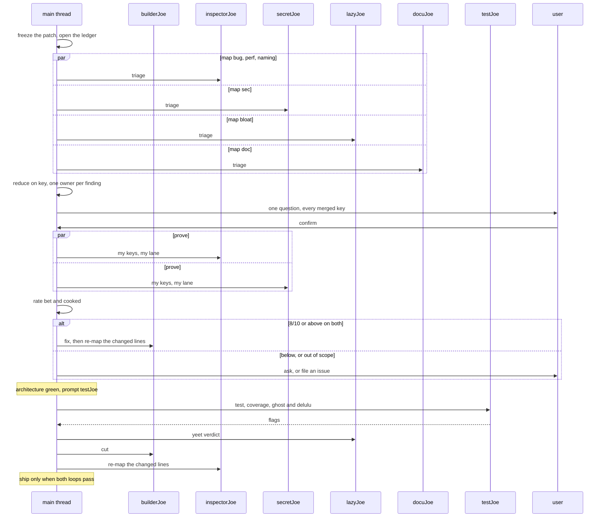

SuperJoe = a crew. Use it as two **iterative loops**, not a one-shot dispatch: architecture first, then testing. The main thread runs the loops; agents do one step each.

Every joe reads [CONTRACT.md](../../CONTRACT.md): one patch, one ledger, one owner per finding.

## Tests

NEVER run tests, a test runner, or the test suite from the main thread.
NEVER run linters or pre-commit hooks.
Route every test run to `testJoe`.
Ask for the smallest selection that covers the change.
The user shares this machine, and test runs eat CPU.

Fan out LLM work; serialize CPU work. One prompt per lane, four lanes at most, and never start a test run beside another.

## The architecture loop

A map over the lanes, then a reduce over their keys.

1. **Freeze** — pin the work once: `git diff <ref> > .joe/patch.diff`, or `gh pr diff <n>` for a PR. Open `.joe/ledger.md` with the run header. Every later prompt points at those two files, so no joe re-derives the patch.
1. **Map** — hand the frozen patch to every lane in ONE parallel batch: `inspectorJoe` (`bug`, `perf`, `naming`), `secretJoe` (`sec`), `lazyJoe` (`bloat`), `docuJoe` (`doc`). A mapper emits `sus:` lines only: it proves nothing, fixes nothing, traces nothing.
1. **Reduce** — merge the `sus:` lines on the key. One key, one owner, the highest lane wins. Write the rows to the ledger, then ask the user once for the whole map with `AskUserQuestion`: one option per merged key, `none` always present.
1. **Prove** — one parallel prompt per lane owner, carrying the keys it owns and nothing else. Every key comes back `real:` with `bet: N/10 cooked: N/10`, or `cap:`.
1. **Route** — `>= 8` on both axes goes to its fixer. Everything else is reported, asked, or deferred.
1. **Re-map** — a fix re-opens its line and the lanes those lines open. Re-run those lanes on the frozen patch plus the fix; rows outside the fix stay valid, and nothing else is re-read, re-asked, or re-researched.

A mapper with no candidates says so in one line and stops.

## Exit gates

Ship only when both loops pass.

Architecture: no in-scope row at `8/10` or above on both `bet` and `cooked`, nothing exploitable in scope, every lane's rows closed.

Testing: 100% coverage, every flagged branch cut.

Only `8/10` or above on both `bet` and `cooked` blocks the gate. Everything else: the user approves it, or it is deferred. A failing gate sends the work back to its owner.

## The confirmation gate

The mappers triage without proving. The user sits between the map and the prove.

1. **Map** — `sus:` lines only. `secretJoe` proves nothing here.
1. **Reduce** — the main thread merges every lane's lines on the key and asks one question: which keys to prove. Nothing runs unconfirmed.
1. **Prove** — the owner confirms or caps each of its keys, then rates the survivors.

| bet    | cooked | Action                                |
| ------ | ------ | ------------------------------------- |
| `>= 8` | `>= 8` | fix now; blocks the gate              |
| `>= 8` | `< 8`  | fix if small, otherwise `side quest:` |
| `< 8`  | `>= 8` | ask the user                          |
| `< 8`  | `< 8`  | report only                           |

A joe prompted alone, `Ledger: none`, asks for itself.

## The testing loop

Its own loop, prompted once the architecture loop is green, never a step inside it.

1. `testJoe` writes tests, hits 100% coverage, flags ghost branches and delulu checks the signature already guarantees. It runs the hooks with `prek` and reports every finding back; an autofix still counts as a finding. It edits no production code.
1. `lazyJoe` tags each flag `yeet:`.
1. `builderJoe` cuts it.

`testJoe` re-runs coverage once per round of cuts, not per cut. Any production change reopens the review and harden gates: the lanes that fix touches, never the whole map.

## Findings

Every agent reports a finding once, in the ledger. Route on the first line that matches:

| Finding                       | Lane                  | Route                                                        |
| ----------------------------- | --------------------- | ------------------------------------------------------------ |
| `sus:`                        | any                   | map only; the user confirms before anything runs             |
| capped `sus:` (`cap:`)        | any                   | route nothing                                                |
| `8/10` or above on both axes  | any                   | fix it, re-map that lane                                     |
| `bet` `>= 8`, `cooked` `< 8`  | any                   | fix if small, otherwise `side quest:`                        |
| `bet` `< 8`                   | any                   | ask the user; never fix, never gate                          |
| out of scope (`side quest:`)  | any                   | file a GitHub issue, change nothing                          |
| exploitability                | `sec`                 | `secretJoe`; nobody else reports one                         |
| bug, performance, naming      | `bug` `perf` `naming` | `inspectorJoe`; nobody else reports one                      |
| over-engineering, dead code   | `bloat`               | `lazyJoe` tags, `builderJoe` cuts                            |
| docs, docstrings, comments    | `doc`                 | `docuJoe`                                                    |
| uncovered, ghost, delulu      | `test`                | `testJoe`; only its loop tests                               |
| packages, APIs, upstream docs | `deps`                | `researchJoe`; one lookup per question, kept as a ledger row |

Two lanes claiming one key is a duplicate, not a finding: the highest lane keeps it, the other emits `cap:`.

## Out-of-scope findings

Deferred, never fixed:

1. The reviewer emits one `side quest: <what>. <why>. [path:L<line>]` line.
1. The main thread writes one `deferred` row and files one `gh issue create`, quoting the line, the repo, and the work reference.
1. No other agent touches it, or any out-of-scope code it notices.

`joe-audit` and `joe-debt` are exempt: their repo-wide list is the deliverable.

## Modes

The crew simplifies at one of three levels. Default: **full**. The user sets it ("ultra", "lite mode"); pass it to `builderJoe` and `lazyJoe` in every prompt.

| Mode  | builderJoe                                                                      | lazyJoe                                                       |
| ----- | ------------------------------------------------------------------------------- | ------------------------------------------------------------- |
| lite  | Builds what's asked; names the lazier alternative in one line.                  | Flags only clear rung violations.                             |
| full  | The ladder enforced: YAGNI -> reuse -> stdlib -> native -> one line -> minimum. | Flags every rung violation.                                   |
| ultra | YAGNI extremist: deletion before addition; challenges the requirement itself.   | Flags speculative anything, including tests beyond one check. |

## One-shot reports

Outside the loop, on request:

- `joe-audit` — whole-repo over-engineering audit, ranked list of what to delete.
- `joe-debt` — harvest `joe:` shortcut comments into a tracked ledger.

## Prompting agents

Prompt = the envelope, nothing else:

- `Work:` the frozen patch, or the file, PR, or branch
- `Goal:` one user story sentence, or `Steps:` QED for a bug
- `Phase:` `triage` to map, `prove` to investigate, `report` for one-shot work
- `Ledger:` `.joe/ledger.md`, or `none`
- `Mode:` the user's mode, to `builderJoe` and `lazyJoe` in every prompt
- `User said:` the user's own words, verbatim

No task lists, no step-by-step, no restating the output contract: it lives in the agent's own file. The work reference bounds the scope, and anything outside it gets a `side quest:` line.

```text
Work: .joe/patch.diff
Goal: As a <role>, I want <capability>, so that <benefit>.
Phase: triage
Ledger: .joe/ledger.md
User said: <explicit instruction, verbatim>
```

or

```text
Work: .joe/patch.diff
Goal: Should return boolean
Steps: 1. click this 2. click that 3. boom! QED
Phase: prove
Ledger: .joe/ledger.md
User said: <explicit instruction, verbatim>
```

## Agents

task -> agent

| Task                          | Agent          | Lane                  |
| ----------------------------- | -------------- | --------------------- |
| write minimal surgical code   | `builderJoe`   | fix                   |
| trim bloat / over-engineering | `lazyJoe`      | `bloat`               |
| concise goal-oriented docs    | `docuJoe`      | `doc`                 |
| review minimalism/perf        | `inspectorJoe` | `bug` `perf` `naming` |
| security research             | `secretJoe`    | `sec`                 |
| tests, coverage, ghost/delulu | `testJoe`      | `test`                |
| find & evaluate packages      | `researchJoe`  | `deps`                |
| orchestrate the loops         | main thread    | —                     |

Rule: main thread loops; each agent does one step. Spawn `researchJoe` from any step when a dependency or fact needs checking; it never edits. Ask it once per question — the ledger row is the answer every other lane reads.

## Flow


```mermaid
sequenceDiagram
    participant Main as main thread
    participant B as builderJoe
    participant I as inspectorJoe
    participant S as secretJoe
    participant L as lazyJoe
    participant D as docuJoe
    participant T as testJoe
    participant U as user

    Main->>Main: freeze the patch, open the ledger
    par map bug, perf, naming
        Main->>I: triage
    and map sec
        Main->>S: triage
    and map bloat
        Main->>L: triage
    and map doc
        Main->>D: triage
    end
    Main->>Main: reduce on key, one owner per finding
    Main->>U: one question, every merged key
    U->>Main: confirm
    par prove
        Main->>I: my keys, my lane
    and prove
        Main->>S: my keys, my lane
    end
    Main->>Main: rate bet and cooked
    alt 8/10 or above on both
        Main->>B: fix, then re-map the changed lines
    else below, or out of scope
        Main->>U: ask, or file an issue
    end
    Note over Main: architecture green, prompt testJoe
    Main->>T: test, coverage, ghost and delulu
    T-->>Main: flags
    Main->>L: yeet verdict
    Main->>B: cut
    Main->>I: re-map the changed lines
    Note over Main: ship only when both loops pass
```
