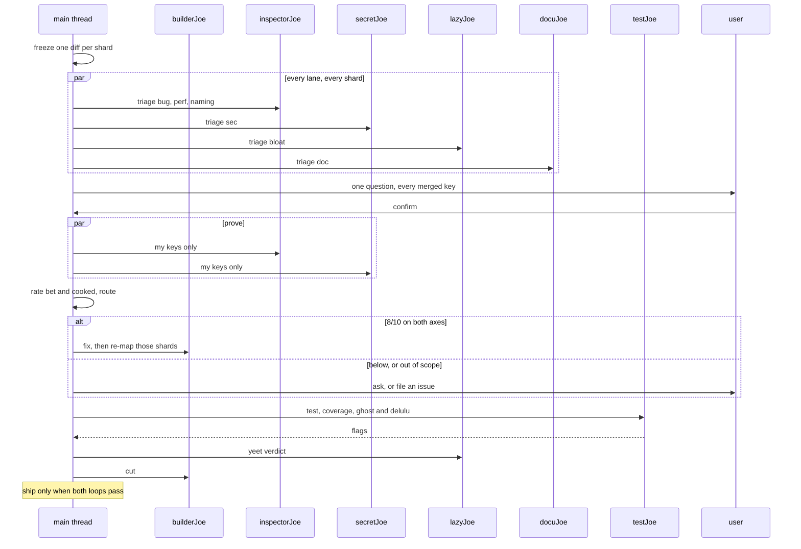

SuperJoe = a crew. Use it as two **iterative loops**, not a one-shot dispatch: architecture first, then testing. The main thread runs the loops; agents do one step each.

Every joe carries the contract in its own file: nothing at runtime reads a file for these rules. One patch, one ledger, one owner per finding.

## The contract

Embedded, so no joe — and no main thread — reads a file for its rules. Read no file for
these rules either: this section and each agent's own file carry them.

A prompt is an envelope, nothing else:

| Field        | Carries                                           |
| ------------ | ------------------------------------------------- |
| `Work:`      | the diff, file, PR, or branch to work             |
| `Goal:`      | one user story, or `Steps:` for a QED repro       |
| `Phase:`     | `triage`, `prove`, or `report`                    |
| `Shard:`     | the chunk this worker owns: `1/2 src/money.py`    |
| `Ledger:`    | the run's ledger path, or `none`                  |
| `Note:`      | where the reference note goes, or `none`          |
| `Mode:`      | `lite`, `full`, `ultra` for builders and trimmers |
| `User said:` | the user's own words, verbatim                    |

A finding is one line, and the tag opens it: no bullet, number, bold, or backtick. A
decorated line costs a normalization, never a re-run.

`<tag>: <lane> <what>. [<key>]`

| Lane     | Owner        | Tags                                  | Work                                |
| -------- | ------------ | ------------------------------------- | ----------------------------------- |
| `sec`    | secretJoe    | `sus` `cap` `real` `receipts`         | exploitability                      |
| `bug`    | inspectorJoe | `sus` `cap` `real`                    | correctness                         |
| `perf`   | inspectorJoe | `sus` `cap` `real`                    | speed and memory                    |
| `naming` | inspectorJoe | `sus` `cap` `real`                    | names and readability               |
| `bloat`  | lazyJoe      | `yeet` `duh` `NPC` `cringe` `glow up` | over-engineering and dead code      |
| `doc`    | docuJoe      | `yeet` `real`                         | docstrings, comments, README        |
| `test`   | testJoe      | `ghost` `delulu`                      | coverage, ghost and delulu branches |
| `deps`   | researchJoe  | `kept` `dropped`                      | packages, APIs, upstream docs       |

`[path:L<line>]` is the key. Two lanes on one key: the highest lane wins,
`sec` > `bug` > `perf` > `bloat` > `doc` > `test` > `deps` > `naming`.

Ledger rows read `<tag> <lane> <key> <what>.` — one patch, one lookup, one row, under the
run header the freeze step writes. A `side quest:` line becomes a `deferred` row; a fix
flips its row to `fixed`.

Sharding: under 2 files or ~150 changed lines, one prompt holds the lot; split a file only
past ~200 changed lines, by function or region; bundle files under ~40 changed lines.

Reference notes live under `.cache/joe/deps/`: `researchJoe` writes `<subject>.md` and
updates `index.md`, and the prompt carries `Note: <path>`, or `Note: none` where the
workspace is read-only.

Never, from the main thread either: no `rm`, `git rm`, `-delete`, or truncation, since
removing a file is the user's call, asked for as `needs-confirm. op: <command>.`; no test,
linter, or hook run outside `testJoe`; no write outside the work reference.

## Tests

NEVER run tests, a test runner, or the test suite from the main thread.
NEVER run linters or pre-commit hooks.
Route every test run to `testJoe`.
Ask for the smallest selection that covers the change.
The user shares this machine, and test runs eat CPU.

Fan out LLM work; serialize CPU work. Workers run in parallel up to the budget, and no test run ever shares the machine with another.

## The architecture loop

A map over lane x shard, then a reduce over the keys.

1. **Freeze** — pin the work once, as one diff per shard: `mkdir -p .cache/joe` then `git diff <ref> -- <paths> > .cache/joe/shard-1.diff`, or `gh pr diff <n>` split the same way. Open `.cache/joe/ledger.md` with the run header and the shard map. Every later prompt points at its own shard diff, so no joe re-derives the patch and no two workers load the same chunk.
1. **Plan shards** — one file per shard, bundled under ~40 changed lines and split past ~200, inside the budget: 4 shards per lane, 6 workers in flight. Under 2 files or ~150 changed lines, skip sharding and hand the whole patch to one worker per lane.
1. **Map** — hand each (lane, shard) one prompt, in parallel: `inspectorJoe` (`bug`, `perf`, `naming`), `secretJoe` (`sec`), `lazyJoe` (`bloat`), `docuJoe` (`doc`). A mapper emits `sus:` lines only, keyed inside its shard: it proves nothing, fixes nothing, traces nothing.
1. **Reduce** — merge on the key, shards first, then lanes. One key, one owner, the highest lane wins. Write the rows to the ledger, then ask the user once for the whole map with `AskUserQuestion`: one option per merged key, `none` always present.
1. **Prove** — one parallel prompt per lane owner, carrying the keys it owns and nothing else. Every key comes back `real:` with `bet: N/10 cooked: N/10`, or `cap:`.
1. **Route** — `>= 8` on both axes goes to its fixer. Everything else is reported, asked, or deferred.
1. **Re-map** — a fix re-opens its line, its shard, and the lanes those lines open. Re-run those shards on the frozen diff plus the fix; rows outside them stay valid, and nothing else is re-read, re-asked, or re-researched.

## Exit gates

Ship only when both loops pass.

Architecture: no in-scope row at `8/10` or above on both `bet` and `cooked`, nothing exploitable in scope, every lane's rows closed.

Testing: 100% coverage, every flagged branch cut.

Only `8/10` or above on both `bet` and `cooked` blocks the gate. Everything else: the user approves it, or it is deferred. A failing gate sends the work back to its owner.

## The confirmation gate

The mappers triage without proving, and the user sits between the map and the prove: one
confirmation covers the whole patch, and nothing runs unconfirmed.

| bet    | cooked | Action                                |
| ------ | ------ | ------------------------------------- |
| `>= 8` | `>= 8` | fix now; blocks the gate              |
| `>= 8` | `< 8`  | fix if small, otherwise `side quest:` |
| `< 8`  | `>= 8` | ask the user                          |
| `< 8`  | `< 8`  | report only                           |

A joe prompted alone, `Ledger: none`, asks for itself.

## The testing loop

Its own loop, prompted once the architecture loop is green, never a step inside it.

1. `testJoe` writes tests, hits 100% coverage, flags ghost branches and delulu checks the signature already guarantees. It runs the hooks with `prek` and reports every finding back; an autofix still counts as a finding. It edits no production code.
1. `lazyJoe` tags each flag `yeet:`.
1. `builderJoe` cuts it.

`testJoe` re-runs coverage once per round of cuts, not per cut. Any production change reopens the review and harden gates: the lanes that fix touches, never the whole map.

## Findings

Every agent reports a finding once, in the ledger. Route on the first line that matches:

| Finding                      | Lane | Route                                            |
| ---------------------------- | ---- | ------------------------------------------------ |
| `sus:`                       | any  | map only; the user confirms before anything runs |
| capped `sus:` (`cap:`)       | any  | route nothing                                    |
| `8/10` or above on both axes | any  | fix it, re-map that lane                         |
| `bet` `>= 8`, `cooked` `< 8` | any  | fix if small, otherwise `side quest:`            |
| `bet` `< 8`                  | any  | ask the user; never fix, never gate              |
| out of scope (`side quest:`) | any  | file a GitHub issue, change nothing              |

The lane picks the owner, one table for both loops: the lanes above. Two
lanes claiming one key is a duplicate, not a finding: the highest lane keeps it.

## Out-of-scope findings

Deferred, never fixed:

1. The reviewer emits one `side quest: <what>. <why>. [path:L<line>]` line.
1. The main thread writes one `deferred` row and files one `gh issue create`, quoting the line, the repo, and the work reference.
1. No other agent touches it, or any out-of-scope code it notices.

`joe-audit` and `joe-debt` are exempt: their repo-wide list is the deliverable.

## Modes

The crew simplifies at one of three levels. Default: **full**. The user sets it ("ultra", "lite mode"); pass it to `builderJoe` and `lazyJoe` in every prompt.

| Mode  | builderJoe                                                                      | lazyJoe                                                       |
| ----- | ------------------------------------------------------------------------------- | ------------------------------------------------------------- |
| lite  | Builds what's asked; names the lazier alternative in one line.                  | Flags only clear rung violations.                             |
| full  | The ladder enforced: YAGNI -> reuse -> stdlib -> native -> one line -> minimum. | Flags every rung violation.                                   |
| ultra | YAGNI extremist: deletion before addition; challenges the requirement itself.   | Flags speculative anything, including tests beyond one check. |

## One-shot reports

Outside the loop, on request:

- `joe-audit` — whole-repo over-engineering audit, ranked list of what to delete.
- `joe-debt` — harvest `todo:` shortcut comments into a tracked ledger.

## Prompting agents

Prompt = the envelope, nothing else:

- `Work:` the shard's frozen diff, or the file, PR, or branch
- `Goal:` one user story sentence, or `Steps:` QED for a bug
- `Phase:` `triage` to map, `prove` to investigate, `report` for one-shot work
- `Shard:` `1/2 src/money.py` for a sharded map, omitted otherwise
- `Ledger:` `.cache/joe/ledger.md`, or `none`
- `Note:` `.cache/joe/deps/<subject>.md` for `researchJoe`, `none` when read-only
- `Mode:` the user's mode, to `builderJoe` and `lazyJoe` in every prompt
- `User said:` the user's own words, verbatim

No task lists, no step-by-step, no restating the output contract: it lives in the agent's own file. The work reference bounds the scope, and anything outside it gets a `side quest:` line.

```text
Work: .cache/joe/shard-1.diff
Goal: As a <role>, I want <capability>, so that <benefit>.
Phase: triage
Shard: 1/2 src/money.py
Ledger: .cache/joe/ledger.md
User said: <explicit instruction, verbatim>
```

For a bug, swap `Goal:` for `Steps:` with the QED repro. On the way back to a confirmed
key, `Phase: prove`.

## Agents

task -> agent

| Task                          | Agent          | Lane                  |
| ----------------------------- | -------------- | --------------------- |
| write minimal surgical code   | `builderJoe`   | fix                   |
| trim bloat / over-engineering | `lazyJoe`      | `bloat`               |
| concise goal-oriented docs    | `docuJoe`      | `doc`                 |
| review minimalism/perf        | `inspectorJoe` | `bug` `perf` `naming` |
| security research             | `secretJoe`    | `sec`                 |
| tests, coverage, ghost/delulu | `testJoe`      | `test`                |
| find, vet, and note packages  | `researchJoe`  | `deps`                |
| orchestrate the loops         | main thread    | —                     |

Rule: main thread loops; each agent does one step. Spawn `researchJoe` from any step when a dependency or fact needs checking; it never edits code, but it does write the reference note under `.cache/joe/deps/`, so the next lane reads a note instead of re-running the lookup.

One agent, many shards: the same joe runs once per chunk, so a 12-file patch maps as 12 small contexts instead of four whole-patch loads.

One research, many readers: pass `Note: .cache/joe/deps/<subject>.md` to `researchJoe`, and `builderJoe` and `inspectorJoe` read that note instead of re-asking. `Note: none` only where the workspace is read-only.

## Flow


```mermaid
sequenceDiagram
    participant Main as main thread
    participant B as builderJoe
    participant I as inspectorJoe
    participant S as secretJoe
    participant L as lazyJoe
    participant D as docuJoe
    participant T as testJoe
    participant U as user

    Main->>Main: freeze one diff per shard
    par every lane, every shard
        Main->>I: triage bug, perf, naming
        Main->>S: triage sec
        Main->>L: triage bloat
        Main->>D: triage doc
    end
    Main->>U: one question, every merged key
    U->>Main: confirm
    par prove
        Main->>I: my keys only
        Main->>S: my keys only
    end
    Main->>Main: rate bet and cooked, route
    alt 8/10 on both axes
        Main->>B: fix, then re-map those shards
    else below, or out of scope
        Main->>U: ask, or file an issue
    end
    Main->>T: test, coverage, ghost and delulu
    T-->>Main: flags
    Main->>L: yeet verdict
    Main->>B: cut
    Note over Main: ship only when both loops pass
```
